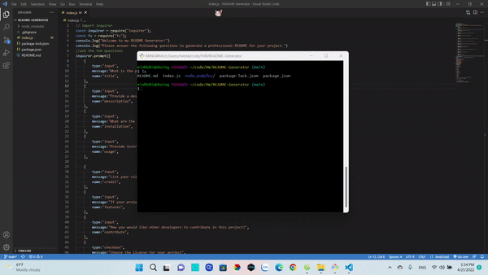

# README Generator


## Badge


## Title
README Generator
## Table of Contents
- [README Generator](#readme-generator)
  - [Badge](#badge)
  - [Title](#title)
  - [Table of Contents](#table-of-contents)
  - [User Story](#user-story)
  - [Description](#description)
  - [Mock-Up](#mock-up)
  - [Tech](#tech)
  - [License](#license)
  - [Link](#link)
  - [Contact](#contact)

## User Story
```md
AS A user
I WANT to create an app that helps me generate ReadMe.md every time I do a new project.
```

## Description
```
WHEN I open the app 
THEN questions about the project I'm working on appear

WHEN I finish answering the questions
THEN the input data will be used to create a ReadMe.md 

WHEN i enter the title of the project 
THEN it become the title of the readme

WHEN i enter my github username 
THEN it becomes my github URL

WHEN i select the license 
THEN it will also become my Badge
```
## Mock-Up
The following image shows the web application's appearance:



## Tech
- [HTML](https://developer.mozilla.org/en-US/docs/Web/HTML)
- [CSS](https://developer.mozilla.org/en-US/docs/Web/CSS)
- [Javascript](https://developer.mozilla.org/en-US/docs/Web/javascript)

## License
[MIT License](LICENSE.txt)

## Link
[Github](https://github.com/minhkhoinguy/README-Generator)

[Video](https://drive.google.com/file/d/1Oy89v9bEq5kP6MbNoVMG9IDXaL-Nws_Y/view?usp=sharing/)

## Contact
Contact me with the link below if you have any questions!

[Github page](https://github.com/minhkhoinguy)

[Email](mailto:minhkhoinguy@gmail.com)

[LinkedIn](https://www.linkedin.com/in/minhkhoi-nguyen-3a8b82237/)
